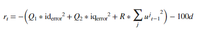
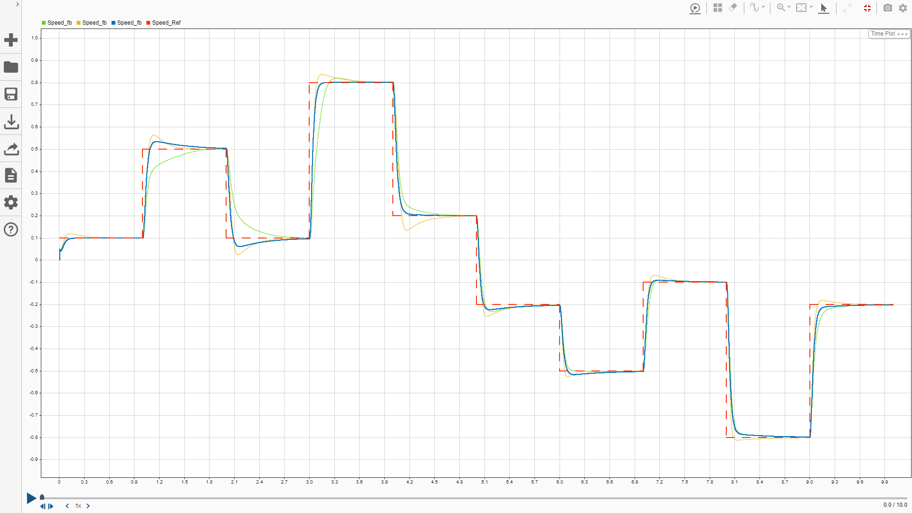

# Simulate PMSM control

This simulates PMSM motor in FOC. in 3 diffrent ways.
current control in 전통적인 PI control,
replaced with RL, and MPC.
go into each directory for each simulation.

in RL this is reward.

below shows the resonse difference depending on the coeffient of reward.

red : refernce speed
green : Q1,Q2 = 10, R = 0.1
yellow : Q1,Q2 = 50, R = 0.5
blue : Q1,Q2 = 5, R = 0.1

To evaluate the response of the step response of simulated data,
use the file 'step_response.mlx'.